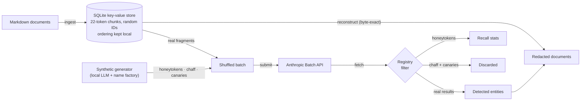
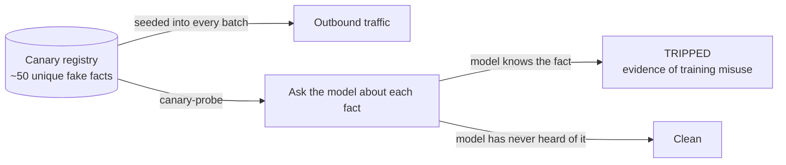

# doc_quantization

Decontextualization pipeline for anonymizing Markdown documents. Documents are
split into small fixed-size token chunks that are processed out of context —
by an LLM or by a human — so that no single party ever sees the full document,
while the original can always be reassembled byte-exactly. Outbound traffic is
additionally salted with synthetic fragments (honeytokens, chaff, canaries)
that only the local registry can subtract.

## How it works



1. **Ingest** — each Markdown file is tokenized (tiktoken) and split into
   consecutive chunks of 22 tokens (configurable). Chunks are stored in a
   SQLite key-value store under random UUIDs. The ordering lives only in a
   local column; a chunk ID leaks neither document identity nor position.
2. **Detect** — chunks are sent shuffled and context-free to the Anthropic
   Message Batches API, mixed with synthetic fragments that are
   indistinguishable from real ones by request shape. Structured outputs
   enforce an exact-substring entity schema:
   `{"entities": [{"text": ..., "type": "person" | "company"}]}`.
3. **Redact** — documents are reassembled byte-exactly from their chunks and
   every detected name is replaced: persons with `**PERSON**`, companies with
   `**COMPANY**`.

Chunking is lossless by construction: token slices are cut via `decode_bytes`
and the boundary is extended whenever a cut would split a multi-byte UTF-8
character, so `"".join(chunks) == original` holds for any input (verified for
Czech diacritics, emoji and CJK).

## Canaries and chaff

Every outbound batch carries three kinds of synthetic fragments. The provider
cannot tell them from real ones; the local registry subtracts them at fetch
time, and a synthetic result can never enter the entities table or the
redacted output (enforced by tests).

| Mechanism | Purpose | Volume |
| --- | --- | --- |
| Honeytokens | Fragments with known fake names; the share the model finds is a live recall measurement per batch and model | ~2% of requests |
| Chaff | Business-prose decoys diluting and poisoning the outbound corpus; a retained copy is worthless without the registry | 1:1 with real fragments |
| Canaries | ~50 globally unique fabricated facts continuously seeded into traffic; later probes test models for knowledge of them | ~5 per batch |



Design invariant: fake names and canary facts come from a deterministic
seeded factory and are registered locally **before** anything is sent. The
local LLM only wraps given names in natural prose; its output is validated
verbatim (3 retries, then a deterministic template fallback), so a
hallucination can never poison the registry or the tripwire.

## Installation

```bash
python -m venv .venv
.venv/bin/pip install -r requirements.txt
```

Set `ANTHROPIC_API_KEY` in your environment for the `submit`, `status`,
`fetch` and `canary-probe` commands. Offline commands work without it.

Generating synthetic fragments requires a running local LLM server with an
OpenAI-compatible endpoint — for example [Ollama](https://ollama.com)
(`ollama serve`, `ollama pull qwen2.5:7b`), LM Studio, or a llama.cpp server.
Point `synthetic.llm.base_url` in `config/config.json` at it. Without one,
commands fail fast with an actionable message.

## Usage

```bash
# 1. Ingest a directory of Markdown files
python -m doc_quant.cli ingest ./documents

# 2. List ingested documents
python -m doc_quant.cli docs

# 3. Submit unprocessed chunks + synthetics (shuffled) to the Batch API
python -m doc_quant.cli submit

# 4. Poll the batch until it has ended, then collect results
python -m doc_quant.cli status <batch_id>
python -m doc_quant.cli fetch <batch_id>

# 5. Write redacted documents
python -m doc_quant.cli redact ./redacted

# Synthetic fragments: recall report and training-misuse probe
python -m doc_quant.cli synthetic-report
python -m doc_quant.cli canary-probe [--model MODEL]
```

### Manual fragment workflow

Any chunk can be handed to a person (for example a translator) who sees only
the isolated fragment, never the document:

```bash
python -m doc_quant.cli chunk get <chunk_id> > fragment.txt
# ... the fragment is transformed externally ...
python -m doc_quant.cli chunk set <chunk_id> --file fragment.txt
python -m doc_quant.cli reconstruct <doc_id> -o document.md
```

## Configuration

All tunables live in `config/config.json`:

| Key | Default | Meaning |
| --- | --- | --- |
| `chunking.chunk_size_tokens` | `22` | Tokens per stored chunk |
| `chunking.encoding` | `cl100k_base` | tiktoken encoding |
| `chunking.name_run_max_extension_tokens` | `12` | Max extra tokens a cut may move so it never splits a capitalized name run |
| `anthropic.model` | `claude-opus-5` | Detection model |
| `anthropic.effort` | `low` | Reasoning effort for detection requests |
| `anthropic.max_tokens` | `1024` | Max output tokens per request |
| `redaction.person` | `**PERSON**` | Placeholder for person names |
| `redaction.company` | `**COMPANY**` | Placeholder for company names |
| `synthetic.honeytokens_enabled` | `true` | Mix honeytokens into batches |
| `synthetic.chaff_enabled` | `true` | Mix chaff into batches |
| `synthetic.canaries_enabled` | `true` | Seed canaries into batches |
| `synthetic.chaff_ratio` | `1.0` | Chaff fragments per real fragment |
| `synthetic.honeytoken_rate` | `0.02` | Honeytokens per real fragment |
| `synthetic.canary_set_size` | `50` | Size of the persisted canary set |
| `synthetic.canaries_per_batch` | `5` | Canaries re-seeded into each batch |
| `synthetic.seed` | `20260818` | Seed for the deterministic name factory |
| `synthetic.llm.base_url` | `http://localhost:11434/v1` | OpenAI-compatible local LLM endpoint |
| `synthetic.llm.model` | `qwen2.5:7b` | Local model for synthetic prose |

## Privacy model, honestly

Decontextualization reduces context exposure; it does not eliminate it:

- The provider still reads the names themselves — that is the essence of the
  detection task. What it never receives is the full document, its identity,
  or the chunk ordering.
- All chunks are submitted from one account, so "these fragments belong
  together" is observable; "in what order, forming what, and which of them
  are even real" is not — half of the traffic is chaff.
- Each detection request exposes at most `chunk_size + 2 * margin` tokens of
  contiguous text (38 tokens with the defaults).
- A worst-case retained copy of the traffic is diluted 1:1 with synthetic
  fragments only the local registry can subtract, and it is booby-trapped:
  `canary-probe` turns suspected training misuse into a measurable event.

If you need stronger guarantees, run a local NER model instead — nothing
leaves the machine and this pipeline is unnecessary.

## Known limitations

- Replacement is case-sensitive and verbatim: inflected name forms must be
  returned by the model as separate entities, otherwise they remain.
- When different chunks classify the same string as both `person` and
  `company`, `person` wins (safer over-redaction).
- Re-ingesting the same directory creates new documents; there is no
  deduplication.

## Development

```bash
.venv/bin/pytest -q
```

## License

Apache License 2.0 — see [LICENSE](LICENSE).
